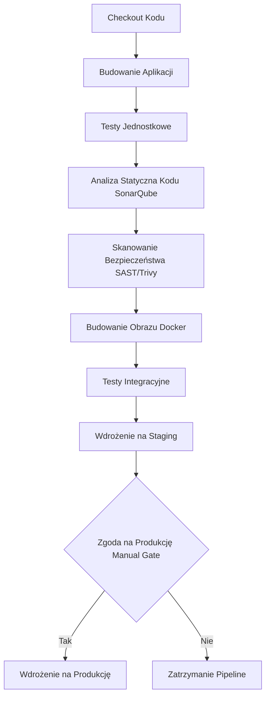

# Diagram Pipeline CI/CD Jenkins

Oto kod diagramu Mermaid reprezentującego pełny proces CI/CD w Jenkinsie dla aplikacji webowej:

```mermaid
flowchart TD
    A[Checkout Kodu] --> B[Budowanie Aplikacji]
    B --> C[Testy Jednostkowe]
    C --> D[Analiza Statyczna Kodu SonarQube]
    D --> E[Skanowanie Bezpieczeństwa SAST/Trivy]
    E --> F[Budowanie Obrazu Docker]
    F --> G[Testy Integracyjne]
    G --> H[Wdrożenie na Staging]
    H --> I{Zgoda na Produkcję Manual Gate}
    I -- Tak --> J[Wdrożenie na Produkcję]
    I -- Nie --> K[Zatrzymanie Pipeline]
```